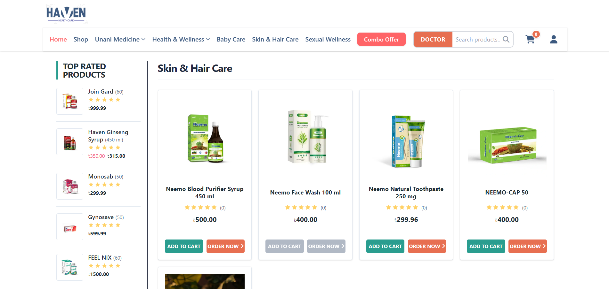
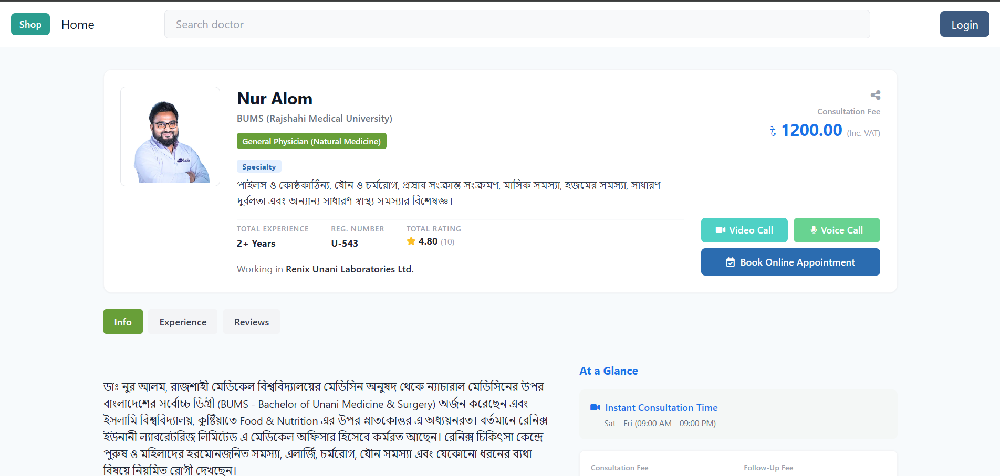

# Haven Healthcare

An industry-standard, enterprise-grade digital healthcare platform that seamlessly integrates traditional **Unani medicine** with modern clinical workflows. The ecosystem combines a sophisticated Doctor-Patient Consultation Management System with an authentic Herbal Medicine E-Commerce Marketplace.

Built with **Django**, **PostgreSQL**, and containerized using **Docker Production Stacks**, Haven Healthcare bridges the gap between holistic alternative medicine and contemporary digital efficiency.

---

## 📸 Application Preview

### 🏠 Homepage & Doctor-Patient Consultation Suite


_The primary application landing page features a minimalist navigation interface, direct consultation pathways, consolidated universal search, and secure authenticating controls._

### 🛒 Authentic Herbal E-Store Marketplace


_The dedicated e-commerce catalog showcases responsive product inventory management side-by-side with localized sorting matrices._

### 🩻 Comprehensive Medical Practitioner Profiles


_Detailed practitioner overview highlighting medical credentials, scheduling availability, and direct booking interfaces._

---

## 🚀 Core Capabilities & Architecture

### 🩺 Advanced Appointment Ecosystem

- **Multi-Role Dashboards:** Distinct user workflows optimized for Patients, Specialized Unani Practitioners, and Medical Administrative Staff.
- **Granular Availability Engines:** Real-time scheduling slot allocations, automated status progression (`Pending` $\rightarrow$ `Confirmed` $\rightarrow$ `Completed` / `Cancelled`), and historical consultation logs.

### 🛒 Robust E-Commerce Infrastructure

- **Authentic Remedial Catalog:** Comprehensive inventory schemas highlighting detailed ingredient formulations, traditional indications, and health guidelines.
- **Cart & Order Lifecycle Management:** Fully state-synchronized shopping cart interactions backed by server-side atomic updates.
- **Secure Transaction Layer:** Production-ready integrations engineered for international payment gateways (Stripe).

### 🛡️ Enterprise Security & Identity

- **Role-Based Access Control (RBAC):** Custom structural user models splitting functional privileges natively across Patient, Doctor, and Administrator instances.
- **Data Protection:** Multi-layered request filters and secure, programmatic configuration isolation through dotenv environments.

---

## 🛠️ Technical Stack & Ecosystem

| Layer                       | Technology                  | Operational Utilization                                                                    |
| :-------------------------- | :-------------------------- | :----------------------------------------------------------------------------------------- |
| **Backend Framework**       | Django 5.x / Python 3.11+   | Secure MVC structure, Object-Relational Mapping (ORM), Form and ModelForm API enforcement. |
| **Database Engine**         | PostgreSQL                  | Relational transactional safety, relational integrity, and strict scaling configurations.  |
| **Frontend Architecture**   | Tailwind CSS v4, Alpine.js  | Minimalist, ultra-responsive editorial interfaces, utility-first performance optimization. |
| **Global State Management** | Redux Architecture          | Global client-side interface state synchronization across dynamic UI widgets.              |
| **Container Execution**     | Docker & Docker Compose     | Multi-container microservice isolation, standard environment synchronization.              |
| **Payment Gateway**         | SSLCommerz / Stripe Sandbox | PCI-DSS compliant secure financial settlement endpoints.                                   |

---

## 📂 Structural Directory Architecture

As extracted from the project environment context, the application enforces a modular, domain-driven structure:

```text
HAVEN_HEALTHCARE/
├── core/                   # Sovereign Project Hub
│   ├── __init__.py
│   ├── asgi.py            # Asynchronous Gateway Interface
│   ├── settings.py        # Centralized Application Configuration
│   ├── urls.py            # Global Routing System
│   ├── views.py           # Top-Level Root Matrix views
│   └── wsgi.py            # Synchronous Server Gateway
├── accounts/               # Custom RBAC Identity Models (Patient/Doctor Profiles)
├── appointments/           # Appointment Logic & Booking Engines
├── payments/               # Payment Settlement Implementations
├── products/               # Herbal E-Store Catalog & Inventory Controls
├── static/                 # Central Assets (Production Compiled CSS/JS, Media)
├── templates/              # Server-Side Rendered Base Layout HTML
├── .dockerignore           # Asset Isolation Exclusions
├── .env                    # Decoupled Security Credentials (Untracked)
├── .gitignore              # Version Control Safe List
├── docker-compose.yml      # Local Multi-Container Services Composition
├── Dockerfile              # Standard Multi-Stage Production Build Image
├── manage.py               # Django Command Line Administrative Execution
├── package.json            # Node Environment Definitions (Tailwind CSS v4 Engines)
├── package-lock.json       # Strict Dependency Lock Tree
├── requirements.txt        # Python Application Dependencies
└── readme.md               # Enterprise Documentation Manifesto
```

---

## ⚙️ Local Development & Deployment Workflows

This system is completely containerized. Docker handles database initialization, runtime compilation, and local server execution automatically.

---

### 🐋 Prerequisites

Ensure you have the following software installed on your engine:

- **Docker Desktop** (Engine version 20.10+ recommended)
- **Docker Compose**

### 🚀 Containerized Execution (Recommended)

#### 1. Clone the Project Codebase

```bash
git clone [https://github.com/your-username/haven-healthcare.git](https://github.com/your-username/haven-healthcare.git)
cd haven-healthcare
```

#### 2. Setup Secret Environments

Create a `.env` file in the root project directory and input appropriate testing variables:

```env
DEBUG=True
SECRET_KEY=django-insecure-your-production-safe-key-here
DB_NAME=haven_db
DB_USER=haven_admin
DB_PASSWORD=haven_secure_pass
DB_HOST=db
DB_PORT=5432
```

## 3. Build and Start Container Services

Execute the orchestration layer via Docker Compose. This automatically spins up the Python runtime, provisions the PostgreSQL database cluster, and hooks the networks together:

```bash
docker compose up --build
```

## 4. Perform Schema Migrations Inside Container

Open a secure terminal inside the running Django web container to compile database configurations:

```bash
docker compose exec web python manage.py makemigrations
docker compose exec web python manage.py migrate
```

## 5. Provision Administrative Superuser

```bash
docker compose exec web python manage.py createsuperuser
```

## 6. Target Endpoint Matrix

- **Local Sandbox Endpoint:** http://localhost:8000
- **Core Django Administration Portal:** http://localhost:8000/admin

## 🐍 Legacy Native Environment Deployment

If running outside a Docker context, execute standard dependency pipelines:

```bash
# 1. Instantiate Virtual Environment
python -m venv venv
source venv/bin/activate  # Windows Terminal: venv\Scripts\activate

# 2. Install Node Dependencies (Tailwind CSS v4 Engine)
npm install

# 3. Pull Python Packages
pip install -r requirements.txt

# 4. Migrate and Boot
python manage.py makemigrations
python manage.py migrate
python manage.py runserver
```

## 🤝 Contribution Guidelines

1. **Fork** the repository down to your GitHub hub.
2. Formulate a feature branch matching tracking tags: `git checkout -b feature/clinical-analytics`.
3. Force linting compliance and commit shifts: `git commit -m "feat: integrate patient analytics metrics"`.
4. Push upstream: `git push origin feature/clinical-analytics`.
5. Instantiate a **Pull Request (PR)** targeting the development branch for core architecture evaluation.

## 📄 Licensing & Standard Compliance

Distributed under the **MIT License**. Check out `LICENSE` for more explicit regulatory transparency.
